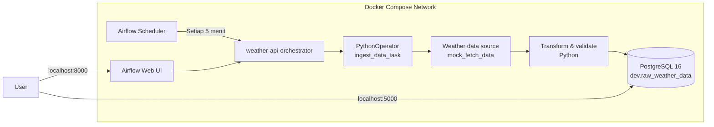

# Weather Data Pipeline with Apache Airflow


Pipeline data sederhana untuk mengambil data cuaca, menjalankannya secara terjadwal dengan Apache Airflow, lalu menyimpan hasilnya ke PostgreSQL. Seluruh layanan dijalankan menggunakan Docker Compose sehingga lingkungan pengembangan mudah direproduksi.

> **Status proyek:** pipeline menggunakan data mock secara default sehingga dapat dicoba tanpa API key atau koneksi ke layanan cuaca eksternal.

## Arsitektur



Alur eksekusinya:

1. Airflow Scheduler menjalankan DAG `weather-api-orchestrator` setiap 5 menit.
2. `PythonOperator` memanggil fungsi utama di `api-request/inset_records.py`.
3. Pipeline mengambil data cuaca mock dari `api-request/api_request.py`.
4. Schema dan tabel dibuat jika belum tersedia.
5. Data dimasukkan ke tabel PostgreSQL `dev.raw_weather_data`.

## Teknologi

| Komponen | Fungsi |
| --- | --- |
| Apache Airflow 3.3.2 | Orkestrasi dan penjadwalan pipeline |
| PostgreSQL 16 | Penyimpanan metadata Airflow dan data cuaca |
| Python | Pengambilan serta pemuatan data |
| psycopg2 | Koneksi Python ke PostgreSQL |
| Docker Compose | Menjalankan seluruh layanan secara konsisten |

## Struktur Proyek

```text
weather-data-project/
├── airflow/
│   └── dags/
│       └── orchestrator.py       # Definisi DAG Airflow
├── api-request/
│   ├── api_request.py            # Sumber data cuaca mock/API
│   └── inset_records.py          # Koneksi dan insert ke PostgreSQL
├── postgres/
│   └── airflow_init.sql          # Inisialisasi database baru
├── Dockerfile                    # Image Airflow dan dependency Python
├── docker-compose.yaml           # Konfigurasi Airflow dan PostgreSQL
└── README.md
```

## Prasyarat

Pastikan perangkat sudah memiliki:

- [Docker](https://docs.docker.com/get-docker/)
- Docker Compose v2 (`docker compose`)
- Port `8000` dan `5000` dalam keadaan tersedia

## Menjalankan Proyek

1. Clone repository dan masuk ke direktorinya:

   ```bash
   git clone <repository-url>
   cd weather-data-project
   ```

2. Build dan jalankan layanan:

   ```bash
   docker compose up -d --build
   ```

3. Pastikan kedua container berjalan:

   ```bash
   docker compose ps
   ```

   PostgreSQL seharusnya berstatus `healthy`, sedangkan Airflow berstatus `Up`.

4. Buka Airflow Web UI di [http://localhost:8000](http://localhost:8000).

   Username bawaan mode standalone adalah `admin`. Password dibuat otomatis ketika Airflow pertama kali dijalankan dan dapat ditemukan dengan:

   ```bash
   docker compose logs af | grep "Password for user"
   ```

5. Cari DAG `weather-api-orchestrator`, aktifkan toggle **Unpause**, kemudian tunggu jadwal berikutnya atau tekan **Trigger DAG** untuk menjalankannya langsung.

## Memverifikasi Data

Masuk ke PostgreSQL:

```bash
docker compose exec db psql -U db_user -d db
```

Kemudian jalankan:

```sql
SELECT
    id,
    city,
    temperature,
    weather_description,
    wind_speed,
    time,
    inserted_at,
    utc_offset
FROM dev.raw_weather_data
ORDER BY inserted_at DESC
LIMIT 10;
```

Atau jalankan query langsung dari terminal:

```bash
docker compose exec db psql -U db_user -d db \
  -c "SELECT * FROM dev.raw_weather_data ORDER BY inserted_at DESC LIMIT 10;"
```

## Konfigurasi

| Konfigurasi | Nilai development | Keterangan |
| --- | --- | --- |
| Airflow UI | `http://localhost:8000` | Web UI dan monitoring DAG |
| PostgreSQL host dari komputer | `localhost:5000` | Akses database dari host |
| PostgreSQL host dari container | `db:5432` | Akses database melalui jaringan Compose |
| Database | `db` | Database utama |
| Schema data | `dev` | Schema tabel cuaca |
| Jadwal DAG | Setiap 5 menit | Diatur di `orchestrator.py` |

Variabel koneksi yang didukung oleh script:

| Environment variable | Default |
| --- | --- |
| `POSTGRES_HOST` | `db` |
| `POSTGRES_PORT` | `5432` |
| `POSTGRES_DB` | `db` |
| `POSTGRES_USER` | `db_user` |
| `POSTGRES_PASSWORD` | `db_password` |

## Perintah Berguna

```bash
# Melihat log semua layanan
docker compose logs -f

# Melihat log Airflow saja
docker compose logs -f af

# Memeriksa DAG import error
docker compose exec af airflow dags list-import-errors

# Menampilkan daftar DAG
docker compose exec af airflow dags list

# Menghentikan layanan tanpa menghapus data PostgreSQL
docker compose down
```

## Menggunakan Weather API Sungguhan

Saat ini `mock_fetch_data()` dipakai agar pipeline dapat dijalankan secara lokal tanpa ketergantungan eksternal. Untuk beralih ke API sungguhan:

1. Simpan API key sebagai environment variable atau Docker secret; jangan commit API key ke Git.
2. Aktifkan fungsi pengambilan API di `api-request/api_request.py`.
3. Ubah `inset_records.py` agar memanggil fungsi API tersebut sebagai pengganti `mock_fetch_data()`.
4. Tambahkan timeout, retry, dan validasi response sebelum data dimasukkan ke database.

## Troubleshooting

| Masalah | Pemeriksaan atau solusi |
| --- | --- |
| DAG tidak muncul | Jalankan `docker compose exec af airflow dags list-import-errors` dan periksa syntax DAG. |
| DAG tidak berjalan otomatis | Pastikan DAG sudah di-**unpause** melalui Airflow UI. |
| `password authentication failed` | Pastikan connection string Airflow cocok dengan kredensial service `db`. |
| `connection refused` ke PostgreSQL | Dari container gunakan host `db` dan port `5432`, bukan `localhost:5000`. |
| Port sudah digunakan | Ubah port sisi kiri pada mapping `8000:8080` atau `5000:5432`. |
| Perubahan dependency tidak terbaca | Jalankan kembali `docker compose up -d --build`. |

> Script `postgres/airflow_init.sql` hanya dijalankan otomatis ketika direktori data PostgreSQL masih kosong. Mengubah file tersebut tidak menginisialisasi ulang database yang sudah memiliki data.

## Catatan Keamanan

Konfigurasi saat ini ditujukan untuk development lokal. Sebelum digunakan pada production:

- pindahkan seluruh password dan API key ke environment variable atau secret manager;
- ganti kredensial default;
- gunakan auth manager Airflow yang sesuai untuk production;
- jangan mengekspos port PostgreSQL ke jaringan publik;
- tambahkan backup, observability, retry policy, dan pembatasan akses database.

## Pengembangan Berikutnya

- Mengaktifkan sumber data Weatherstack secara aman.
- Menambahkan validasi kualitas data.
- Memisahkan database metadata Airflow dari database analytics.
- Menambahkan unit test dan integration test.
- Menambahkan transformasi serta dashboard cuaca.
